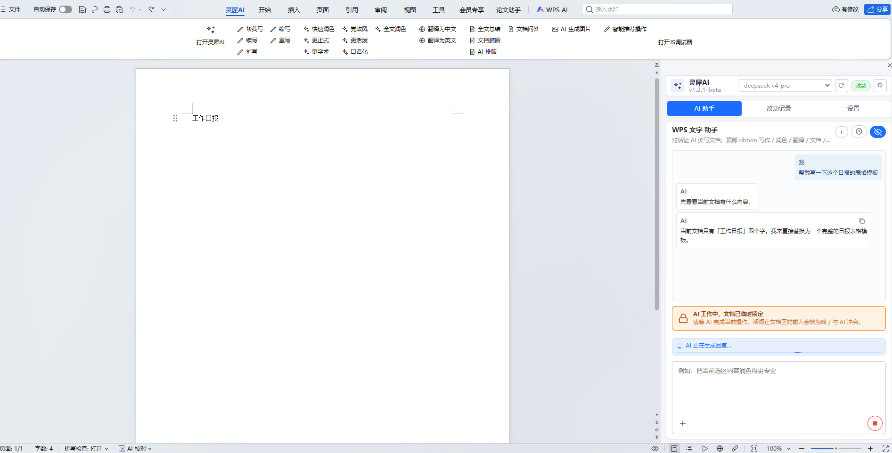
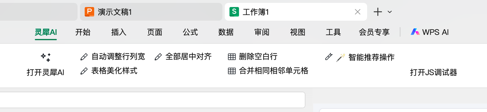
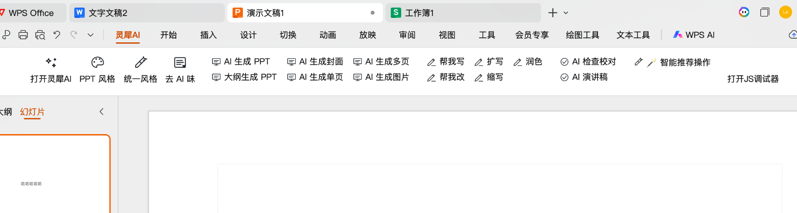

# Anthony AI · WPS Office Multi-host AI Assistant

**🌐 Language**: [中文](README.md) · **English**

A single TaskPane for **WPS Writer / Spreadsheet / Presentation / PDF**, with multiple chat AI providers (Codex / OpenAI-compatible / Anthropic) + an image provider. AI invokes tools to read and write the document directly.

> 🤖 100% vibe-coded : architecture, provider adapters, PPT themes/charts, Word rendering, cross-platform installers, and docs — all iterated through dialog between [Claude](https://claude.com/claude-code) and human prompts. Not a single line was hand-typed. Feel free to fork and vibe yourself.

---

## Screenshots

| WPS Writer | WPS Spreadsheet | WPS Presentation |
|---|---|---|
|  |  |  |

---

## Quick Start (5 min)

### 1. Download

| Platform | Installer | Size |
|---|---|---|
| **Windows** | [`lingxi-ai-1.3.0-setup.exe`](https://github.com/lewis-hui1202/WPS-AI/releases) | ~30 MB |
| **macOS** | [`lingxi-ai-1.3.0.pkg`](https://github.com/lewis-hui1202/WPS-AI/releases) (double-click to install) | ~35 MB |

Both bundle Node runtime — **no separate Node install needed**.

### 2. Install

- **Windows**: Temporarily disable antivirus real-time protection → double-click setup.exe → fully quit WPS → reopen WPS. The "Anthony AI" ribbon tab means success.
- **macOS**: **Right-click .pkg → Open** (Gatekeeper blocks unsigned packages on double-click) → enter system password → fully quit WPS → reopen.

For details (uninstall / upgrade / troubleshooting / installer build) see [INSTALL.md](INSTALL.md).

### 3. Configure AI

1. Click "Open Anthony AI" in the ribbon → TaskPane opens on the right → ⚙ Settings (standalone 960×720 dialog)
2. Chat panel → **+ Add Provider** → pick one of 12 presets (baseURL pre-filled)
3. Fill in API Key → ⚡ Test → close dialog → pick a model from the header dropdown and chat

**Multiple providers concurrently**: DeepSeek + Anthropic + Codex + Kimi can all be enabled; switch freely from the dropdown.

| Preset | baseURL (pre-filled) |
|---|---|
| **Codex (ChatGPT OAuth)** | (OAuth) |
| **Anthropic** / **OpenAI** | `api.anthropic.com` / `api.openai.com` |
| **DeepSeek** / **Kimi** / **Qwen** | DeepSeek / Moonshot / DashScope compatible |
| **GLM** / **Doubao** / **SiliconFlow** / **OpenRouter** | each provider's OpenAI-compatible URL |
| **Local Ollama** | `http://localhost:11434/v1` (no key) |
| **Custom** | Fill URL + Key yourself |

#### System Requirements

| Item | Windows | macOS |
|---|---|---|
| **OS** | Windows 10 / 11 (x64) | macOS 10.15 Catalina+ (Intel + Apple Silicon) |
| **WPS** | WPS Office 12.x+ | WPS Office 5.x+ |
| **Runtime** | Bundled portable Node 22.x | Bundled darwin-x64 + arm64 Node |
| **Permission** | Installs into user dir by default | System password required (writes to `/Library/Application Support/LingxiAI/`) |

Not supported: WebOffice, mobile WPS, lower-versioned desktop clients — JSAPI add-ins require desktop client + the versions above.

---

## Features

### Cross-host

**AI Integration**
- Multiple chat providers concurrently (Codex / Anthropic / 11 OpenAI-compatible + custom); header dropdown grouped by provider
- 3 capability icons per model: 🖼 image / 📄 PDF / 💡 thinking
- Adjustable thinking budget (low / medium / high / off) mapped per protocol: `thinking.budget_tokens` / `reasoning_effort` / `reasoning.effort`
- PDF as multimodal attachment: Claude uses document block / OpenAI Files API / Codex input_file
- Streaming + tool-use loop: AI chains multiple tool calls within one turn
- **Preview-confirm mode** vs **Direct-write mode**: two safety levels

**TaskPane**
- Settings and PPT style preset are standalone WPS dialog windows (escape TaskPane width limits)
- One-tap detach / dock: floating window with 8 resize handles
- Modals adapt to screen resolution (no overflow on small screens)

**Conversation**
- Multi-conversation management + full history replay (reasoning + tool calls + text)
- Claude-Code-style tool call bubble: shows only the tail by default, disappears when the result arrives; full JSON available behind a "Developer log" toggle
- Progress bar includes the most recent reasoning/output tail
- AI-working doc-lock banner merged with progress indicator (no longer visually stacked)
- Attachments: image / PDF / text files
- System prompt customizable; supports "Skills" (4 built-in + .md/.txt import) injected into system prompt by scenario

**Safety**
- Hard doc lock while AI works (Word `Document.Protect` / Excel `UserInterfaceOnly`)
- Unsaved documents reject mutations (fail-fast before AI runs, no waiting for output)
- Per-turn document backup + one-click revert (auto-GC last 20)
- Change Log tab: grouped by file, expand to see args / before/after snapshots / errors
- Config import/export (API Key encrypted + version compat)

### Writer / Spreadsheet / Presentation / PDF

| Host | At a glance |
|---|---|
| **Writer** | 6 quick-action groups (Write / Rewrite / Polish / Translate / Summarize / Smart) + markdown→Word native rendering (real tables + nested lists + paragraph indent reset) |
| **Spreadsheet** | Cell/range read-write, batch format, table beautify, autofit columns, AI formula/proofreading/data reshape |
| **Presentation** | 12 design-themed palettes + 8 shape templates + 4 SVG visual templates + 6 chart types + outline-to-PPT + HTML template system (freeform + ECharts + layered insert) + unified style + de-AI-isms |
| **PDF** | Bilingual translation (markdown side-by-side) + summary + outline-to-PPT + Q&A + smart action suggestions |

### MCP Server (new in v1.4)

Settings → MCP → enable to expose WPS tools to external agents (Claude Code CLI / Claude Desktop / Cursor):
- One-click copy config JSON (auto-filled with plugin install path)
- Tools grouped by host
- Live status badge (Connected / Enabled-not-connected / Disabled)

---

## Project Layout

```text
plugin/
├── taskpane.html                  # main UI entry
├── main.js                        # script loader
├── manifest.json / ribbon.xml     # plugin declaration + ribbon
├── css/style.css
├── js/
│   ├── app.js                     # UI orchestration
│   ├── wps.js / hosts/*           # host dispatch + jsapi bridge per host
│   ├── providers/*                # provider registry + 12 presets + capabilities
│   ├── tools/*                    # AI-callable tools (grouped by host + registry)
│   ├── html-templates/*           # template system (cache / components / renderer / studio)
│   ├── mcp-bridge.js              # MCP bridge (plugin side)
│   └── skills.js                  # skills (built-in + import)
└── tools/
    ├── proxy-server.js            # CORS proxy + file ops + backup + MCP endpoints
    ├── mcp-server.js              # stdio MCP server (for external agents)
    ├── serve-permanent.js         # permanent-mode static server
    ├── build-variants.js          # multi-host variant build
    └── dev.js / gen-ribbon.js
```

---

## Development

```bash
cd plugin
npm install
npm run dev:wps   # or dev:et / dev:wpp / dev:pdf
```

Spawns CORS proxy (3890) and wpsjs debug (3889); WPS launches automatically.

**Add a tool** — edit `js/tools/<host>.js`:
```js
registry.registerTool({
  name: "wps_my_tool",
  hosts: ["wps"],                // or ["wps","et","wpp","pdf"]
  description: "...",            // the clearer, the more likely AI calls it
  parameters: { type: "object", properties: { ... }, required: [...] },
  handler: async (params) => ({ ok: true, ... })
});
```

**Add a ribbon button** — edit `js/quick-actions.js`, then `npm run gen-ribbon`.

**Repack permanent mode** — `node tools/build-variants.js --out C:/path/dist-permanent`.

---

## Known Limitations

- WPS desktop only; Web/Mobile WPS unsupported
- Mac WPS WKWebView occasionally needs cache clear after permanent-mode reinstall (see [INSTALL.md](INSTALL.md) Q7)
- wpsjs debug registers one host at a time; restart to switch host during dev
- Codex OAuth is an unofficial reuse; may break if OpenAI changes auth policy
- Image provider hardcoded to toapis protocol; adapt in `providers/image.js` for others

---

## Feedback

When reporting a bug please include:
- OS + WPS version
- Which host, which tool triggered the issue
- Console errors (right-click TaskPane → Inspect / "Open JS Debugger")
- Last 50 lines of `~/.lingxi-ai/server.log` (permanent mode)

---

## Changelog

Full changelog in [CHANGELOG.md](CHANGELOG.md).

- **v1.4** (WIP): HTML template system (freeform + ECharts + layered insert) / Skills / MCP server / responsive modals / standalone PPT style preset window
- **v1.3**: PDF host / multi-provider management / settings dialog / free TaskPane layout
- **v1.2.1**: Multi-conversation / change log / doc lock / config encryption
- **v1.1**: Permanent install upgrade / Mac WKWebView cache fix / IME compat
- **v1.0**: First release (permanent install / 12 themes / 6 charts / multi-provider)
